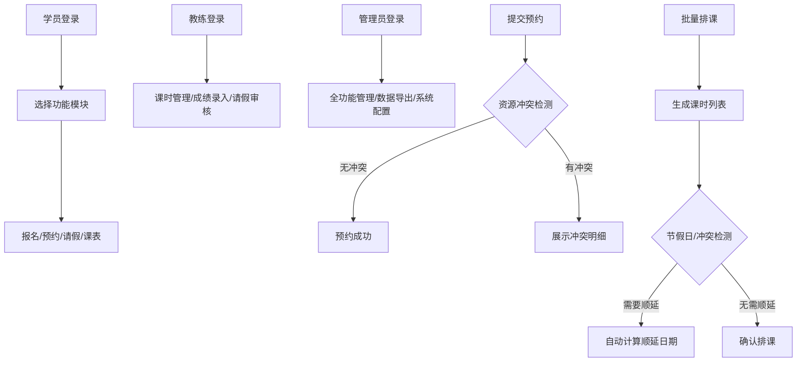

## 1. 产品概述
驾校一体化网页管理平台，实现学员从报名到拿证的全流程数字化管理。解决传统驾校人工管理效率低、资源调度冲突、数据统计难等问题，服务于管理员、教练、学员三类角色。

- 核心价值：资源智能调度、流程标准化、数据可视化
- 目标用户：驾校管理人员、教练员、学员

## 2. 核心功能

### 2.1 用户角色

| 角色 | 注册方式 | 核心权限 |
|------|----------|----------|
| 管理员 | 后台创建 | 全系统管理、数据导出、参数配置 |
| 教练 | 管理员创建 | 课时管理、学员管理、成绩录入、请假审核 |
| 学员 | 自助报名 | 信息查看、预约练车/考试、课表查看、请假申请 |

### 2.2 功能模块

1. **登录认证**：角色区分登录、权限校验、会话管理
2. **仪表盘**：数据统计概览、到期提醒、待办事项
3. **学员报名**：信息录入、证件上传、字段校验、重复报名过滤
4. **预约管理**：练车预约、科目考试预约、资源冲突校验
5. **课时编排**：批量排课、学员分组、课时顺延
6. **请假管理**：学员请假申请、教练/管理员审核
7. **考试管理**：成绩录入、考试安排、档案归档
8. **系统管理**：用户管理、场地管理、教练管理、参数配置

### 2.3 页面详情

| 页面名称 | 模块名称 | 功能描述 |
|----------|----------|----------|
| 登录页 | 认证模块 | 账号密码登录、角色选择、验证码 |
| 仪表盘 | 数据概览 | 报名统计、预约统计、课时统计、到期提醒卡片 |
| 学员报名 | 报名管理 | 多步骤表单、证件附件上传、实时字段校验 |
| 学员列表 | 报名管理 | 学员信息查询、编辑、删除、状态管理 |
| 练车预约 | 预约管理 | 日历视图选择、场地/教练/时间段选择、冲突检测 |
| 考试预约 | 预约管理 | 科目选择、考试场次预约、成绩查询 |
| 课时安排 | 排课管理 | 批量排课表单、学员分组、课时调整顺延 |
| 课表查看 | 排课管理 | 周/月视图课表、课时详情 |
| 请假申请 | 请假管理 | 请假表单提交、请假记录查询 |
| 请假审核 | 请假管理 | 待审核列表、通过/驳回操作 |
| 成绩录入 | 考试管理 | 成绩录入表单、成绩列表、合格统计 |
| 档案管理 | 考试管理 | 学员档案归档、到期提醒、档案查询 |
| 用户管理 | 系统管理 | 管理员/教练用户增删改查、角色分配 |
| 场地管理 | 系统管理 | 训练场地、考试场地增删改查 |
| 数据导出 | 系统管理 | 按条件筛选、批量导出Excel |

## 3. 核心流程

### 3.1 学员报名流程
学员填写报名信息 → 上传证件照片 → 系统字段校验 → 查重校验 → 提交审核 → 缴费确认 → 报名成功

### 3.2 预约流程
选择预约类型（练车/考试） → 选择日期和时间段 → 选择场地/教练 → 系统冲突校验 → 无冲突则预约成功 → 有冲突则展示冲突明细

### 3.3 排课流程
选择排课周期 → 选择时间段和场地 → 分配教练 → 选择学员分组 → 批量生成课时 → 课时顺延处理（节假日/冲突）

### 3.4 请假流程
学员提交请假申请（附原因） → 课时状态标记为待审核 → 教练/管理员审核 → 通过则课时顺延/取消 → 驳回则恢复原课时

## 4. 用户界面设计

### 4.1 设计风格
- 主色调：深蓝色（#1e40af）代表专业可信，辅助色：绿色（#10b981）代表成功通过，橙色（#f59e0b）代表提醒警告
- 按钮风格：圆角8px，悬停有阴影和颜色渐变效果
- 字体：标题使用Noto Sans SC Bold，正文使用Noto Sans SC Regular
- 布局：左侧导航栏 + 顶部面包屑 + 主内容区卡片式布局
- 图标：使用Lucide图标库，保持统一风格

### 4.2 页面设计概要

| 页面名称 | 模块名称 | UI元素 |
|----------|----------|--------|
| 登录页 | 认证模块 | 渐变背景、居中卡片表单、角色切换标签 |
| 仪表盘 | 数据概览 | 统计卡片网格、折线图趋势、环形图占比、提醒列表 |
| 学员报名 | 报名管理 | 多步骤进度条、表单项级联、上传预览区、校验提示 |
| 预约管理 | 预约管理 | 日历组件、时间段选择网格、冲突高亮提示 |
| 课时安排 | 排课管理 | 时间轴视图、拖拽调整、批量操作工具栏 |
| 请假审核 | 请假管理 | 待办卡片列表、审批操作按钮、备注输入框 |

### 4.3 响应式设计
- 桌面端优先（1920px），适配1366px及以上
- 侧边栏在窄屏可折叠，主内容区自适应
- 表格支持横向滚动，表单在小屏变为单列布局
- 移动端优化触控区域，按钮最小高度44px

### 4.4 交互动效
- 页面加载：骨架屏占位，内容渐入
- 表单提交：按钮加载状态，成功/失败Toast提示
- 冲突检测：震动动画 + 红色边框高亮
- 数据导出：进度条展示，完成后下载提示
