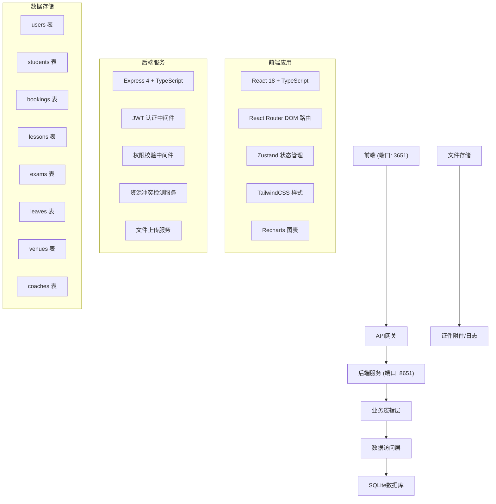
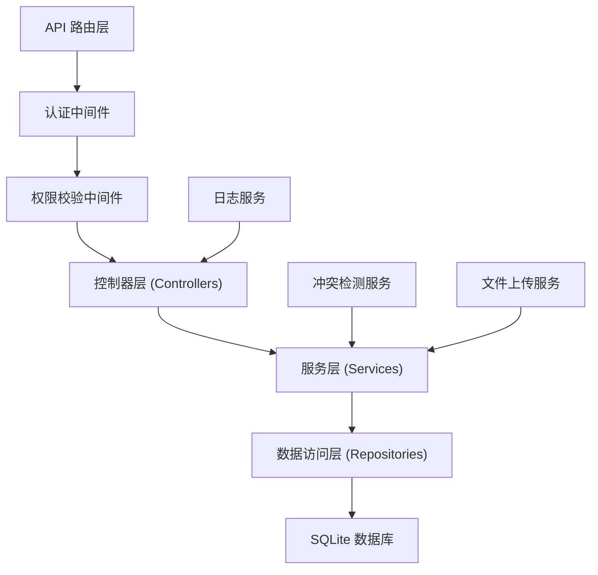
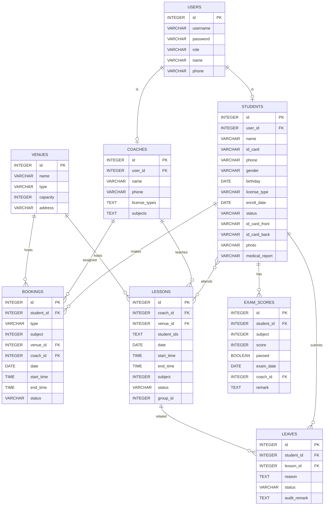

## 1. 架构设计



## 2. 技术描述

- 前端：React@18 + TypeScript + Vite + TailwindCSS@3 + Zustand + React Router DOM + Recharts + Lucide React
- 后端：Express@4 + TypeScript + JWT + bcryptjs + multer + better-sqlite3
- 数据库：SQLite（本地文件存储）
- 初始化工具：vite-init
- 数据导出：xlsx（Excel导出）
- 日志：winston（独立日志文件）
- 双端口架构：前端3651，后端8651

## 3. 路由定义

### 前端路由（3651端口）

| 路由 | 页面 | 权限角色 |
|------|------|----------|
| /login | 登录页 | 公开 |
| / | 仪表盘 | admin/coach/student |
| /students/enroll | 学员报名 | admin |
| /students/list | 学员列表 | admin/coach |
| /booking/practice | 练车预约 | admin/coach/student |
| /booking/exam | 考试预约 | admin/coach/student |
| /lessons/schedule | 课时编排 | admin/coach |
| /lessons/timetable | 课表查看 | admin/coach/student |
| /leave/apply | 请假申请 | student |
| /leave/audit | 请假审核 | admin/coach |
| /exam/score | 成绩录入 | admin/coach |
| /exam/archive | 档案管理 | admin |
| /system/users | 用户管理 | admin |
| /system/venues | 场地管理 | admin |
| /system/export | 数据导出 | admin |

### 后端API路由（8651端口）

| 方法 | 路由 | 功能 | 权限 |
|------|------|------|------|
| POST | /api/auth/login | 用户登录 | 公开 |
| GET | /api/auth/me | 获取当前用户 | 已登录 |
| POST | /api/students | 创建学员 | admin |
| GET | /api/students | 学员列表 | admin/coach |
| GET | /api/students/:id | 学员详情 | admin/coach |
| PUT | /api/students/:id | 更新学员 | admin |
| DELETE | /api/students/:id | 删除学员 | admin |
| POST | /api/students/check-duplicate | 重复报名校验 | admin |
| POST | /api/students/upload | 证件上传 | admin |
| POST | /api/bookings | 创建预约 | admin/coach/student |
| GET | /api/bookings | 预约列表 | admin/coach/student |
| POST | /api/bookings/check-conflict | 冲突检测 | admin/coach/student |
| DELETE | /api/bookings/:id | 取消预约 | admin/coach/student |
| POST | /api/lessons/batch | 批量排课 | admin/coach |
| GET | /api/lessons | 课时列表 | admin/coach/student |
| PUT | /api/lessons/:id/postpone | 课时顺延 | admin/coach |
| POST | /api/leaves | 提交请假 | student |
| GET | /api/leaves | 请假列表 | admin/coach/student |
| PUT | /api/leaves/:id/audit | 审核请假 | admin/coach |
| POST | /api/exams/scores | 录入成绩 | admin/coach |
| GET | /api/exams/scores | 成绩列表 | admin/coach/student |
| POST | /api/exams/archive | 档案归档 | admin |
| GET | /api/venues | 场地列表 | admin/coach/student |
| POST | /api/venues | 创建场地 | admin |
| GET | /api/coaches | 教练列表 | admin/coach/student |
| GET | /api/export/data | 数据导出 | admin |
| GET | /api/dashboard/stats | 仪表盘统计 | admin/coach |
| GET | /api/dashboard/reminders | 到期提醒 | admin/coach/student |

## 4. API 数据类型定义

```typescript
// 用户类型
type UserRole = 'admin' | 'coach' | 'student';

interface User {
  id: number;
  username: string;
  role: UserRole;
  name: string;
  phone: string;
  createdAt: string;
}

// 学员类型
interface Student {
  id: number;
  userId?: number;
  name: string;
  idCard: string;
  phone: string;
  gender: 'male' | 'female';
  birthday: string;
  address: string;
  licenseType: 'C1' | 'C2' | 'B1' | 'B2' | 'A1' | 'A2';
  enrollDate: string;
  status: 'pending' | 'approved' | 'rejected' | 'completed';
  idCardFront?: string;
  idCardBack?: string;
  photo?: string;
  medicalReport?: string;
  createdAt: string;
}

// 预约类型
type BookingType = 'practice' | 'exam';
type BookingStatus = 'pending' | 'confirmed' | 'cancelled' | 'completed';

interface Booking {
  id: number;
  studentId: number;
  type: BookingType;
  subject?: number;
  venueId: number;
  coachId?: number;
  date: string;
  startTime: string;
  endTime: string;
  status: BookingStatus;
  conflictInfo?: ConflictInfo;
}

// 冲突信息
interface ConflictInfo {
  hasConflict: boolean;
  conflicts: {
    type: 'venue' | 'coach' | 'student';
    id: number;
    name: string;
    startTime: string;
    endTime: string;
  }[];
}

// 课时类型
type LessonStatus = 'scheduled' | 'completed' | 'cancelled' | 'leave';

interface Lesson {
  id: number;
  coachId: number;
  venueId: number;
  studentIds: number[];
  date: string;
  startTime: string;
  endTime: string;
  subject: number;
  status: LessonStatus;
  groupId?: number;
}

// 请假类型
type LeaveStatus = 'pending' | 'approved' | 'rejected';

interface Leave {
  id: number;
  studentId: number;
  lessonId: number;
  reason: string;
  status: LeaveStatus;
  auditRemark?: string;
  createdAt: string;
}

// 考试成绩
interface ExamScore {
  id: number;
  studentId: number;
  subject: number;
  score: number;
  passed: boolean;
  examDate: string;
  coachId: number;
  remark?: string;
}

// 场地类型
type VenueType = 'training' | 'exam';

interface Venue {
  id: number;
  name: string;
  type: VenueType;
  capacity: number;
  address: string;
}

// 教练类型
interface Coach {
  id: number;
  userId: number;
  name: string;
  phone: string;
  licenseType: string[];
  subjects: number[];
}
```

## 5. 服务端架构



## 6. 数据模型

### 6.1 ER图



### 6.2 DDL语句

```sql
-- 用户表
CREATE TABLE users (
  id INTEGER PRIMARY KEY AUTOINCREMENT,
  username VARCHAR(50) UNIQUE NOT NULL,
  password VARCHAR(255) NOT NULL,
  role VARCHAR(20) NOT NULL CHECK (role IN ('admin', 'coach', 'student')),
  name VARCHAR(50) NOT NULL,
  phone VARCHAR(20),
  created_at DATETIME DEFAULT CURRENT_TIMESTAMP
);

-- 学员表
CREATE TABLE students (
  id INTEGER PRIMARY KEY AUTOINCREMENT,
  user_id INTEGER REFERENCES users(id),
  name VARCHAR(50) NOT NULL,
  id_card VARCHAR(18) UNIQUE NOT NULL,
  phone VARCHAR(20) NOT NULL,
  gender VARCHAR(10) CHECK (gender IN ('male', 'female')),
  birthday DATE,
  address VARCHAR(255),
  license_type VARCHAR(10) NOT NULL CHECK (license_type IN ('C1', 'C2', 'B1', 'B2', 'A1', 'A2')),
  enroll_date DATE NOT NULL,
  status VARCHAR(20) NOT NULL DEFAULT 'pending' CHECK (status IN ('pending', 'approved', 'rejected', 'completed')),
  id_card_front VARCHAR(255),
  id_card_back VARCHAR(255),
  photo VARCHAR(255),
  medical_report VARCHAR(255),
  created_at DATETIME DEFAULT CURRENT_TIMESTAMP
);

-- 教练表
CREATE TABLE coaches (
  id INTEGER PRIMARY KEY AUTOINCREMENT,
  user_id INTEGER REFERENCES users(id),
  name VARCHAR(50) NOT NULL,
  phone VARCHAR(20) NOT NULL,
  license_types TEXT,
  subjects TEXT,
  created_at DATETIME DEFAULT CURRENT_TIMESTAMP
);

-- 场地表
CREATE TABLE venues (
  id INTEGER PRIMARY KEY AUTOINCREMENT,
  name VARCHAR(100) NOT NULL,
  type VARCHAR(20) NOT NULL CHECK (type IN ('training', 'exam')),
  capacity INTEGER DEFAULT 1,
  address VARCHAR(255),
  created_at DATETIME DEFAULT CURRENT_TIMESTAMP
);

-- 预约表
CREATE TABLE bookings (
  id INTEGER PRIMARY KEY AUTOINCREMENT,
  student_id INTEGER REFERENCES students(id) NOT NULL,
  type VARCHAR(20) NOT NULL CHECK (type IN ('practice', 'exam')),
  subject INTEGER,
  venue_id INTEGER REFERENCES venues(id) NOT NULL,
  coach_id INTEGER REFERENCES coaches(id),
  date DATE NOT NULL,
  start_time TIME NOT NULL,
  end_time TIME NOT NULL,
  status VARCHAR(20) NOT NULL DEFAULT 'pending' CHECK (status IN ('pending', 'confirmed', 'cancelled', 'completed')),
  created_at DATETIME DEFAULT CURRENT_TIMESTAMP
);

-- 课时表
CREATE TABLE lessons (
  id INTEGER PRIMARY KEY AUTOINCREMENT,
  coach_id INTEGER REFERENCES coaches(id) NOT NULL,
  venue_id INTEGER REFERENCES venues(id) NOT NULL,
  student_ids TEXT NOT NULL,
  date DATE NOT NULL,
  start_time TIME NOT NULL,
  end_time TIME NOT NULL,
  subject INTEGER NOT NULL,
  status VARCHAR(20) NOT NULL DEFAULT 'scheduled' CHECK (status IN ('scheduled', 'completed', 'cancelled', 'leave')),
  group_id INTEGER,
  created_at DATETIME DEFAULT CURRENT_TIMESTAMP
);

-- 请假表
CREATE TABLE leaves (
  id INTEGER PRIMARY KEY AUTOINCREMENT,
  student_id INTEGER REFERENCES students(id) NOT NULL,
  lesson_id INTEGER REFERENCES lessons(id) NOT NULL,
  reason TEXT NOT NULL,
  status VARCHAR(20) NOT NULL DEFAULT 'pending' CHECK (status IN ('pending', 'approved', 'rejected')),
  audit_remark TEXT,
  created_at DATETIME DEFAULT CURRENT_TIMESTAMP
);

-- 成绩表
CREATE TABLE exam_scores (
  id INTEGER PRIMARY KEY AUTOINCREMENT,
  student_id INTEGER REFERENCES students(id) NOT NULL,
  subject INTEGER NOT NULL,
  score INTEGER NOT NULL,
  passed BOOLEAN NOT NULL,
  exam_date DATE NOT NULL,
  coach_id INTEGER REFERENCES coaches(id),
  remark TEXT,
  created_at DATETIME DEFAULT CURRENT_TIMESTAMP
);

-- 档案表
CREATE TABLE archives (
  id INTEGER PRIMARY KEY AUTOINCREMENT,
  student_id INTEGER REFERENCES students(id) NOT NULL,
  archive_date DATE NOT NULL,
  archive_type VARCHAR(50) NOT NULL,
  file_path VARCHAR(255),
  created_at DATETIME DEFAULT CURRENT_TIMESTAMP
);

-- 索引
CREATE INDEX idx_bookings_date ON bookings(date, start_time);
CREATE INDEX idx_lessons_date ON lessons(date, start_time);
CREATE INDEX idx_students_status ON students(status);
CREATE INDEX idx_leaves_status ON leaves(status);

-- 初始化数据
INSERT INTO users (username, password, role, name, phone) VALUES 
('admin', '$2a$10$...', 'admin', '系统管理员', '13800000000'),
('coach1', '$2a$10$...', 'coach', '张教练', '13800000001'),
('coach2', '$2a$10$...', 'coach', '李教练', '13800000002');

INSERT INTO coaches (user_id, name, phone, license_types, subjects) VALUES 
(2, '张教练', '13800000001', '["C1", "C2"]', '[1, 2, 3, 4]'),
(3, '李教练', '13800000002', '["C1"]', '[1, 2]');

INSERT INTO venues (name, type, capacity, address) VALUES 
('训练场地A', 'training', 4, '驾校东区1号场地'),
('训练场地B', 'training', 4, '驾校东区2号场地'),
('科目二考场', 'exam', 20, '驾校西区考试中心'),
('科目三考场', 'exam', 30, '驾校南区道路考场');
```
